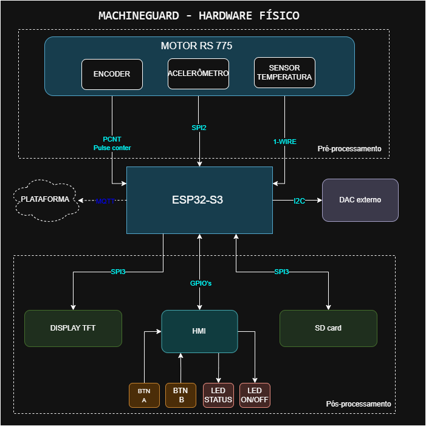
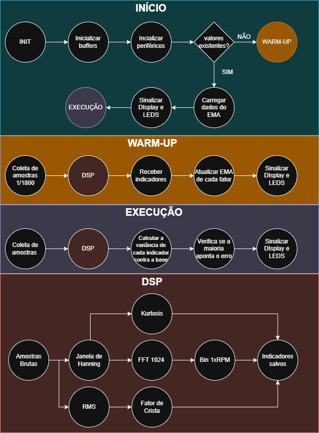
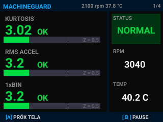
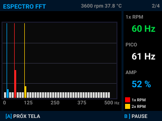
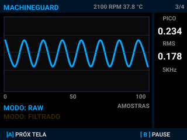
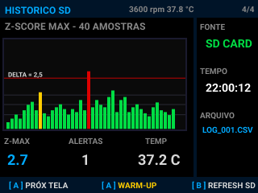

# MachineGuard

### Embedded Predictive Maintenance System for Rotating Machinery

**Embedded DSP • Edge Computing • Condition Monitoring • ESP32-S3**


> 📷 *Prototype image (in development)* 

---

# Overview

MachineGuard is an embedded predictive maintenance system for rotating electric motors. It performs vibration acquisition, digital signal processing and anomaly detection entirely on an ESP32-S3, without cloud services or external processing.

The project aims to demonstrate that early fault detection can be achieved using a low-cost embedded platform while maintaining a transparent and reproducible signal processing pipeline.

---

# The Problem

Mechanical faults such as rotor imbalance and bearing wear produce measurable vibration changes long before temperature increases. However, continuous vibration monitoring is still largely restricted to expensive industrial solutions, making predictive maintenance inaccessible for many applications.

---

# The Solution

MachineGuard combines embedded hardware and digital signal processing to continuously monitor machine vibration in real time.

The entire processing pipeline executes locally on the microcontroller, providing:

- Fully embedded processing
- No cloud or gateway dependency
- Real-time operation
- Low hardware cost (~R$239)
- Transparent and reproducible architecture

---
# System Architecture

MachineGuard is organized into four main layers: hardware, firmware, digital signal processing, and user interface. The architecture separates real-time signal processing from peripheral management, ensuring deterministic execution while maintaining a responsive interface.

---

## Hardware


> 📷 Outdated Hardware diagram

The system is built around an ESP32-S3 and a triaxial LSM6DS3TR-C accelerometer mounted magnetically on the motor housing. Additional peripherals provide visualization, temperature monitoring and user interaction.

| Component | Model |
|-----------|-------|
| MCU | ESP32-S3 N16R8 |
| Accelerometer | LSM6DS3TR-C |
| Display | ILI9341 2.8" SPI |
| Temperature Sensor | DS18B20 |
| Motor | Equacional EA2-80-B3/4 |
| Mounting | Magnetic |

---

## Firmware


> 📷 Outdated Firmware architecture diagram

The firmware is divided into two independent execution domains:

- **Core 0** — Real-time DSP pipeline
- **Core 1** — Display, peripherals and system services

Communication between tasks is performed through FreeRTOS queues, avoiding shared data between cores.

---

## DSP Pipeline

```text
Acquisition
    │
Remove Offset
    │
Convert to g
    │
Time Statistics
    │
FFT
    │
RPM Estimation
    │
1×RPM Amplitude
    │
Adaptive Baseline
    │
Alarms
```

The DSP pipeline continuously processes vibration data and extracts statistical and spectral features used for machine condition monitoring.

---

## User Interface





> 📷 Display screenshots

The TFT interface provides real-time visualization of the machine state, signal statistics and vibration spectrum, allowing the processing pipeline to be inspected during operation.

---

# Team

| Name | Responsibilities |
|------|-------------------|
| **João Pedro Maciel Freitas** | Embedded firmware, DSP, hardware/software integration and documentation |
| **João Pedro Siqueira Job** | Mechanical design, prototype manufacturing and hardware |
| **Núbia Ariela Rezende Costa** | Documentation, organization and project management |

---

# License

This project is licensed under the **MIT License**.

See the [LICENSE](LICENSE) file for more information.
