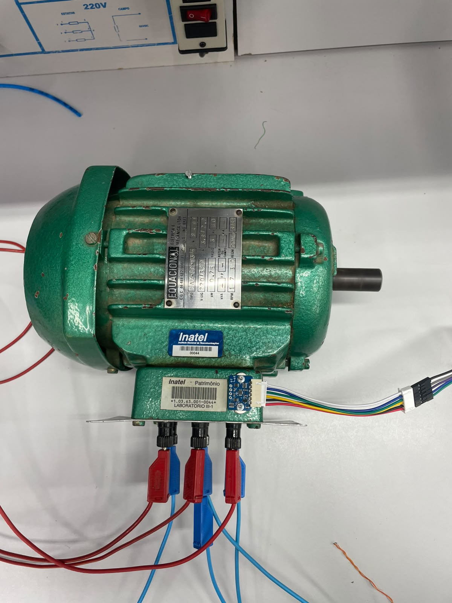
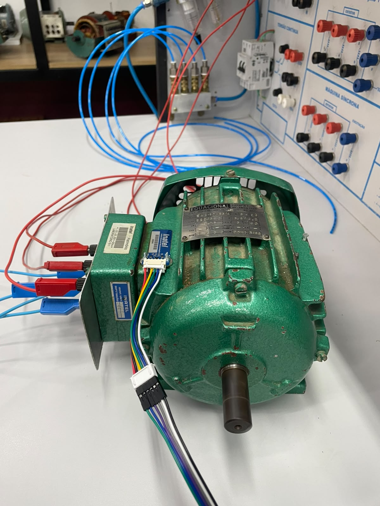
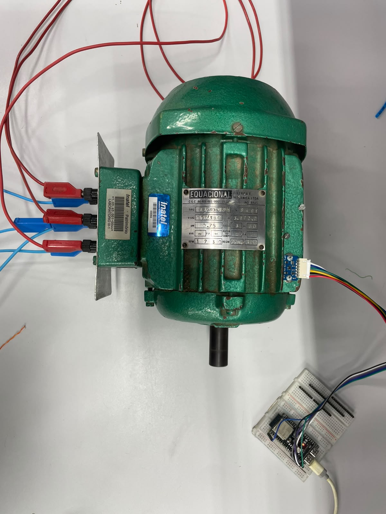

# MachineGuard
## Caderno de Testes – DSP #001
**Título:** Validação da Aquisição e Estatísticas no Domínio do Tempo

---

## Objetivo

Validar o pipeline inicial do DSP:

- Recepção de blocos de 2048 amostras
- Remoção do offset DC
- Cálculo de:
  - Mean
  - RMS
  - Minimum
  - Maximum
  - Peak-to-Peak

O objetivo desta etapa **não é detectar falhas**, mas validar que os indicadores respondem corretamente à vibração do motor.

---

## Configuração

| Item | Valor |
|------|-------|
| Data | 05/08/2006|
| Branch | feature_dsp |
| Commit |feat(dsp): remove DC offset and prepare time-domain signal|
| ESP-IDF |v6.0.2 |
| MCU | ESP32-S3 N16R8 |
| Sensor | LSM6DS3TR-C |
| Escala | ±2 g |
| ODR | 6.66 kHz |
| Eixo analisado |Y|
| Buffer | 2048 amostras |
| Fixação | Ímã de neodímio |
| Motor |Equacional EA2-80-B3/4 trifásico|

---

# Teste 1 — Motor desligado

### Objetivo

Validar ruído de aquisição e estabilidade.

### Procedimento

- Motor desligado.
- Sensor fixado no motor.
- Aguardar estabilização.
- Registrar aproximadamente 10 blocos consecutivos.

### Resultados

| Bloco | Mean | RMS | Min | Max | Peak-to-Peak |
|-------:|-----:|----:|----:|----:|-------------:|
| 1 | 16875.94 | 50.89 | -191.94 | 180.06 | 372.00 |
| 2 | 16874.03 | 48.89 | -180.03 | 149.97 | 330.00 |
| 3 | 16868.48 | 47.71 | -167.48 | 147.52 | 315.00 |
| 4 | 16872.43 | 45.95 | -156.43 | 155.57 | 312.00 |
| 5 | 16871.91 | 48.78 | -184.91 | 182.09 | 367.00 |
| 6 | 16871.68 | 46.31 | -179.68 | 146.32 | 326.00 |
| 7 | 16871.52 | 47.48 | -163.52 | 163.48 | 327.00 |
| 8 | 16871.49 | 46.28 | -174.49 | 180.51 | 355.00 |
| 9 | 16873.49 | 46.89 | -153.49 | 179.51 | 333.00 |
| 10 | 16871.47 | 47.41 | -161.47 | 143.53 | 305.00 |

### Resultado esperado

- Mean aproximadamente constante.
- RMS baixo.
- Peak-to-Peak baixo.
- Pouca variação entre blocos.

### Resultado obtido

- [x] Conforme esperado
- [ ] Divergente

Observações:

---

# Teste 2 — Motor ligado

### Objetivo

Validar resposta dos indicadores à vibração.

### Procedimento

- Ligar o motor.
- Não alterar a posição do acelerômetro.
- Registrar aproximadamente 10 blocos consecutivos.

### Resultados

| Bloco | Mean | RMS | Min | Max | Peak-to-Peak |
|-------:|-----:|----:|----:|----:|-------------:|
| 1 | 16847.60 | 344.19 | -1101.60 | 944.40 | 2046.00 |
| 2 | 16845.25 | 399.83 | -1326.25 | 1234.75 | 2561.00 |
| 3 | 16848.61 | 400.75 | -1393.61 | 1166.39 | 2560.00 |
| 4 | 16846.75 | 380.00 | -1306.75 | 1125.25 | 2432.00 |
| 5 | 16846.16 | 447.10 | -1612.16 | 1452.84 | 3065.00 |
| 6 | 16852.05 | 377.11 | -1311.05 | 1246.95 | 2558.00 |
| 7 | 16849.42 | 368.77 | -1257.42 | 1242.58 | 2500.00 |
| 8 | 16849.02 | 378.19 | -1159.02 | 1615.98 | 2775.00 |
| 9 | 16850.75 | 347.28 | -1300.75 | 1102.25 | 2403.00 |
| 10 | 16848.50 | 346.54 | -1249.50 | 1139.50 | 2389.00 |

### Resultado esperado

Comparado ao Teste 1:

- Mean permanece aproximadamente constante.
- RMS aumenta.
- Peak-to-Peak aumenta.
- Minimum e Maximum apresentam maior amplitude.

### Resultado obtido

- [x] Conforme esperado
- [ ] Divergente

Observações:

# Conclusão

## Critérios de aprovação

- [x] Blocos recebidos continuamente.
- [x] Mean estável entre blocos.
- [x] RMS aumenta com o motor ligado.
- [x] Peak-to-Peak aumenta com o motor ligado.
- [x] Resultados repetíveis após novo acionamento.

---

## Conclusão Geral

- [x]  aprovado
- [ ]  reprovado

Comentários finais:

teste 1:

teste 2:

teste 3:

